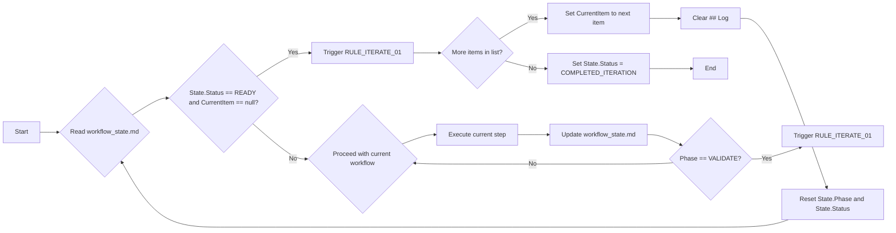

# An Autonomous AI Workflow for Cursor IDE

  
  
<em>A simple, autonomous system for AI-assisted development in Cursor. Now with iterative processing!</em>

## What is this?

This project provides a streamlined way to work with AI assistants (like Claude or GPT-4) inside the Cursor IDE, making development more autonomous and consistent. It helps the AI remember project context and follow a structured process, even across different sessions. Think of it as giving your AI assistant a reliable memory and a clear playbook.  This system now supports iterative processing of lists of items, enhancing its capabilities for complex tasks.

This setup is inspired by the ideas in the original `kleosr/cursorkleosr` repository but simplifies it drastically for better autonomy and lower overhead.

## Thanks to

*   @atalas [Atalas Cursor IDE Profile](https://forum.cursor.com/u/atalas) 
*   @Guayusa [Guayusa Cursor IDE Profile](https://forum.cursor.com/u/Guayusa) 
*   @stevejb [Stevejb Cursor IDE Profile](https://forum.cursor.com/u/stevejb) 
*   @AaronAgility [AaronAgility Cursor IDE Profile](https://forum.cursor.com/u/AaronAgility/summary) 
*   @davesienk [davesienk Cursor IDE Profile](https://forum.cursor.com/u/davesienk/profile-hidden) 
*   @Marlon [Marlon Cursor IDE Profile](https://forum.cursor.com/u/Marlon) 
*   Contributors to the original `kleosr/cursorkleosr` concepts.

## How it Works: The Two-File System

Instead of many complex rule files, this system uses just two core Markdown files:

1.  **`project_config.md` (Long-Term Memory - LTM):**
    *   **Purpose:** Holds the stable, essential information about your project.
    *   **Content:** Project goals, main technologies, critical coding patterns/conventions, key constraints, and now, tokenization settings (e.g., characters per token for estimation).
    *   **Usage:** The AI reads this at the start of major tasks to understand the project's foundation. It's updated infrequently.

2.  **`workflow_state.md` (Short-Term Memory + Rules + Log - STM):**
    *   **Purpose:** The dynamic heart of the system. Tracks the current work session.
    *   **Content:**
        *   `## State`: Current phase (Analyze, Blueprint, etc.), status (Ready, Blocked, etc.), `CurrentItem` (for iteration).
        *   `## Plan`: The step-by-step plan for the current task (created in Blueprint phase).
        *   `## Rules`: **All the operational rules** defining the workflow phases, memory updates, tool use, error handling, iteration logic, and blueprint versioning.
        *   `## Log`: A running log of actions, tool outputs, and decisions made during the session.
        *   `## Items`: A list of items to be processed iteratively (table format).
        *   `## TokenizationResults`: Stores results (summary, token count) for each processed item.
        *   `## Blueprint History`: **NEW:** Automatically archives previous blueprint versions with timestamps and unique IDs to prevent loss of planning work.
    *   **Usage:** The AI reads this file **constantly** before acting and updates it **immediately** after acting. This is how it maintains context and follows the process.

## The Autonomous Loop

The AI operates in a continuous cycle, driven by the `workflow_state.md` file:

**In simple terms:** The AI reads the state, interprets rules, decides what to do, acts via Cursor, observes the result, updates the state, and repeats.  The new iteration feature adds a loop within this main loop, processing items one by one, clearing context between each.

## The Workflow Phases (Defined in `workflow_state.md`)

The `## Rules` section defines a simple, structured workflow:

1.  **[PHASE: ANALYZE]:** Understand the task and context. No coding or planning solutions yet.
2.  **[PHASE: BLUEPRINT]:** Create a detailed, step-by-step plan for implementation. No coding yet.
3.  **[PHASE: CONSTRUCT]:** Execute the plan precisely, using Cursor tools. Handle errors based on rules.  This phase now includes iterative processing of items from the `## Items` section.
4.  **[PHASE: VALIDATE]:** Run tests and checks to ensure the implementation matches the plan and requirements.

The AI follows the constraints of the current phase, guided by the rules in `workflow_state.md`.

## Getting Started

1.  **Locate the Files:** The core files `project_config.md` and `workflow_state.md` are located within the `cursorkleosr/` directory.
2.  **Fill `project_config.md`:** Add your project's specific goals, tech stack, key patterns, constraints, and tokenization settings.
3.  **Instruct the AI:** Start your Cursor chat with a clear system prompt instructing the AI to operate *exclusively* based on these two files and the autonomous loop described above. (A good system prompt is crucial for enforcement!).
    *   *Example Snippet for System Prompt:* "You are an autonomous AI developer. Operate solely based on `project_config.md` and `workflow_state.md`. Before every action, read `workflow_state.md`, determine state, consult `## Rules`, act accordingly, then immediately update `workflow_state.md`."
4.  **Give the First Task:** The AI will initialize based on `RULE_INIT_01` and ask for the first task.

## What about `.cursorrules`?

The main `.cursorrules` file is now less important for the workflow itself. You might still use it for global Cursor settings (like preferred AI models or global ignores), but the core logic resides in `workflow_state.md`.

## License

This project concept is licensed under the MIT License - see the LICENSE file for details.

## Contributing

Feel free to adapt and improve this system. Share your experiences and refinements!

## Blueprint History System
The workflow now includes automatic blueprint versioning to prevent loss of planning work:

- **Automatic Archiving:** When creating new blueprints, existing plans are automatically archived to `## Blueprint History` with timestamps and unique IDs
- **Version Control:** Maintains complete history of all blueprint iterations without overwriting previous work
- **Easy Reference:** Use natural language commands like `"use blueprint from [date]"` or `"show blueprint [ID]"` to retrieve previous planning work
- **Non-Destructive:** Original workflow structure remains intact while providing comprehensive blueprint history

### Blueprint History Commands
- `"Show blueprint from yesterday"` - Retrieve blueprint by date
- `"Use blueprint abc123def"` - Restore specific blueprint by ID
- `"List all previous blueprints"` - Display available blueprint history

## Git Workflow Integration
This workflow now includes a simple, AI-assisted Git integration to encourage consistent version control. After a successful task, the AI will prompt to commit the changes, log the commit SHA to `workflow_state.md`, and allow for simple rollbacks or diffs using natural language.
